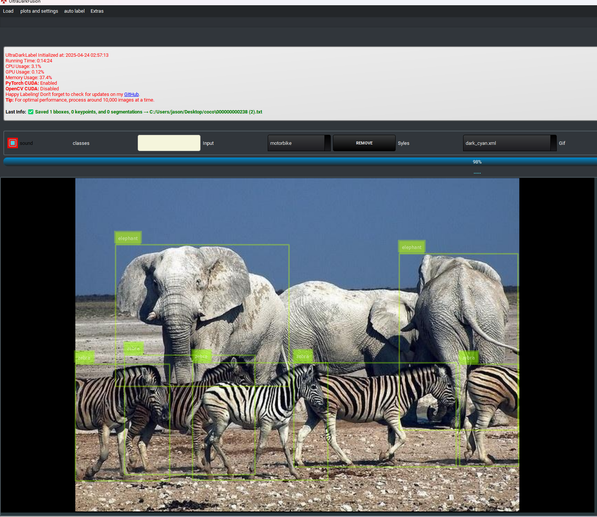
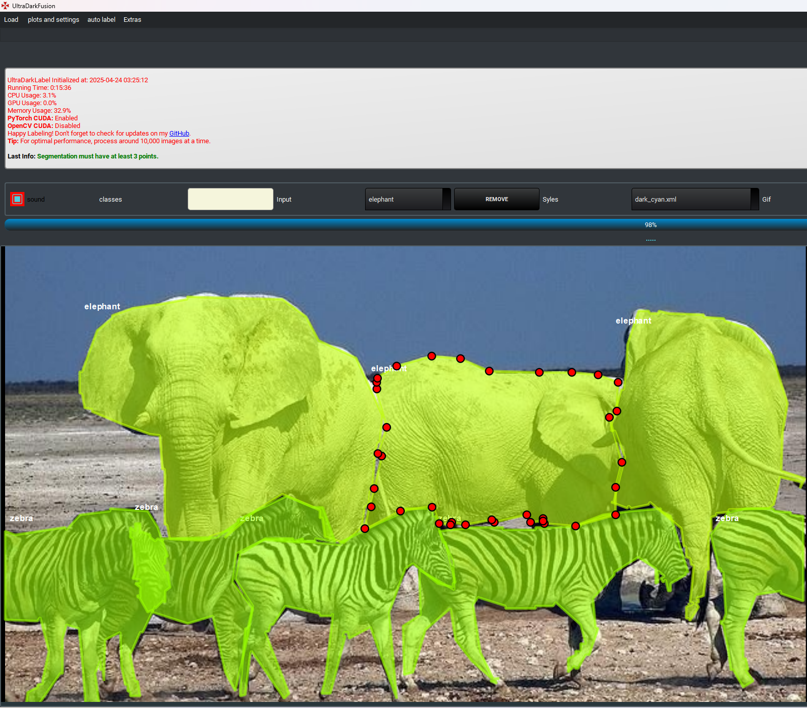
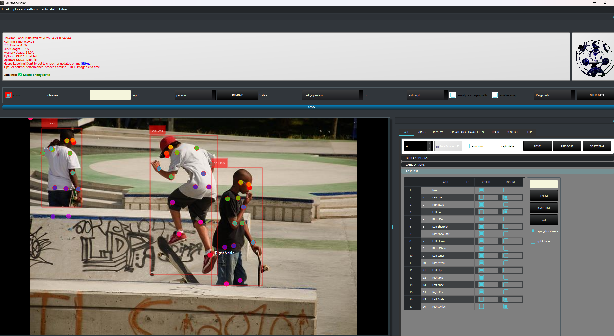
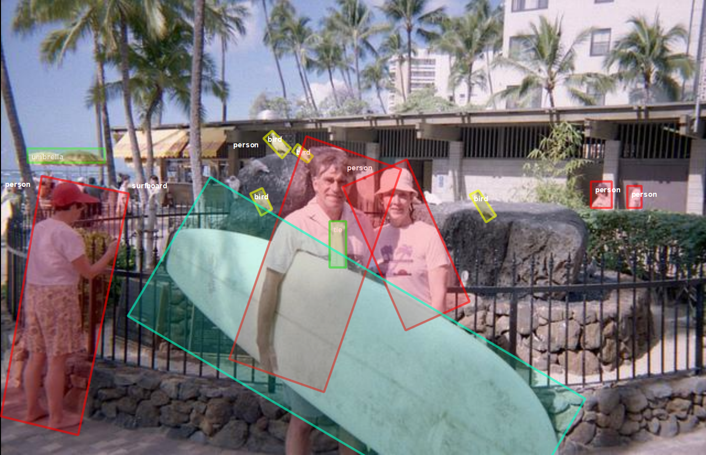

### 🔍 Annotation Support

<table>
  <tr>
    <td></td>
    <td></td>
    <td></td>
    <td></td>
  </tr>
  <tr>
    <td align="center">Bounding Boxes</td>
    <td align="center">Segmentation</td>
    <td align="center">Pose Keypoints</td>
    <td align="center">Oriented Bounding Boxes</td>
  </tr>
</table>


**UltraDarkFusion** is an advanced GUI for object detection, segmentation, keypoints and computer vision, designed to streamline dataset management, annotation, model training, and real-time inference.


### 🚀 What's New in UltraDarkFusion?

- ✅ **Full Segmentation Support** – annotate, train, and run inference on masks with YOLO or SAM.
- ✅ **Pose Estimation** – automatic keypoint detection, annotation, and training-ready exports.
- ✅ **Oriented Bounding Boxes (OBB)** – draw, label, and auto-generate rotated boxes via YOLO OBB or SAM.
- ✅ **Dataset Manager** – organize, deduplicate, and augment your datasets with built-in tools.
- ⚡ **TensorRT Acceleration** – run inference using `.engine` models for max speed.
- 🧠 **Multi-Backend Tracking** – BoT-SORT and ByteTrack support with `.pt`, `.onnx`, and `.engine` formats.
- 🗣️ **Voice-Activated Class Switching** – change classes during labeling by saying the name.
- 🌍 **Multilingual UI Translation** – dynamically switch languages across the entire interface.

### 🎯 Key Features

- 🎨 **Label Anything** – supports boxes, segmentation, keypoints, and OBB — all in one project.
- 🎞️ **Video & YouTube Processing** – auto-label or extract frames directly from video files or YouTube links.
- 🤖 **Automatic Annotation** – batch-label folders.
- 🧩 **Flexible Inference** – switch between PyTorch, ONNX, and TensorRT seamlessly.
- 🧼 **Cleaner UI** – toggle dark/light mode, filter by class, generate heatmaps, and apply custom QSS themes.

---

## 🚀 Installation Guide

### Required Build Tools
Open Command Prompt and run:
```batch
winget install git.git (must restart shell after wards)
winget install Kitware.CMake
winget install --id Microsoft.VisualStudio.2019.BuildTools --source winget --override "--add Microsoft.VisualStudio.Component.VC.Tools.x86.x64 --quiet --wait"
```
### Clone UltraDarkFusion Repository and OpenCV
```batch
cd C:\
git clone https://github.com/lordofkillz/DarkFusion.git
cd DarkFusion
git clone --branch 4.9.0 https://github.com/opencv/opencv.git opencv-4.9.0
git clone --branch 4.9.0 https://github.com/opencv/opencv_contrib.git opencv_contrib-4.9.0
mkdir build install
```

### Mandatory Downloads
- [Download SAM Weights and Files](https://drive.google.com/uc?export=download&id=1Tux3ncgLcCagQ0N3cC25XP4O_UwsjXbP)
  - Extract to `C:\DarkFusion\UltraDarkFusion`


### Anaconda Setup
- Download and install [Anaconda](https://www.anaconda.com/products/distribution).
- Accept default installation settings.
- for experinced devs, just create and environment and pip install -r requirments.txt

### Setup Environment
- Run `fusion_install.bat` as administrator to create and configure the environment:
```batch
cd C:\DarkFusion\
fusion_install.bat
```
### Compile OpenCV with CUDA (Optional)

To compile OpenCV with CUDA acceleration (recommended for improved performance when using .weights):
### Install CUDA and cuDNN
- Install [CUDA 12.8](https://developer.nvidia.com/cuda-toolkit-archive)
- Download cuDNN compatible with CUDA 12.8 from [NVIDIA Developer](https://developer.nvidia.com/cudnn)
- Extract and copy cuDNN files to:
  ```
  C:\Program Files\NVIDIA GPU Computing Toolkit\CUDA\v12.8
  ```
download opencv and opencv-contrib versions with the same as your python versions place both both folders in c:\ create a build and install folder 


```batch
cd C:\DarkFusion\
fusion_cuda.bat
```
### Install CUDA and cuDNN
- Install [CUDA 12.8](https://developer.nvidia.com/cuda-toolkit-archive)
- Download cuDNN compatible with CUDA 12.8 from [NVIDIA Developer](https://developer.nvidia.com/cudnn)
- Extract and copy cuDNN files to:
  ```
  C:\Program Files\NVIDIA GPU Computing Toolkit\CUDA\v12.8
  ```
### Install Darknet

- Install [Darknet by Hank-AI](https://github.com/hank-ai/darknet).

---

## Community and Support
- **UltraDarkFusion Discord:** [Join Discord](https://discord.gg/fZTz8E44)

### Acknowledgments
Special thanks to these open-source projects:
- [SAM (Segment Anything)](https://github.com/facebookresearch/segment-anything)
- [GroundingDINO](https://github.com/IDEA-Research/GroundingDINO)
- [Ultralytics YOLO](https://github.com/ultralytics/ultralytics)
- [SAHI](https://github.com/obss/sahi)

Inspired by [DarkMark](https://github.com/stephanecharette/DarkMark), developed by Stephane from Hank-AI.

### **Goals for UltraDarkFusion**  
- [ ] **Remove OpenCV DNN and create a Python wrapper for Darknet** 
- [ ] **Remove the document-based help and train a chatbot for assistance**  
- [ ] **Improve code efficiency (Ongoing...)**  
- [ ] **Upload UltraDarkFusion to PyPI for easier installation and distribution**  

----


