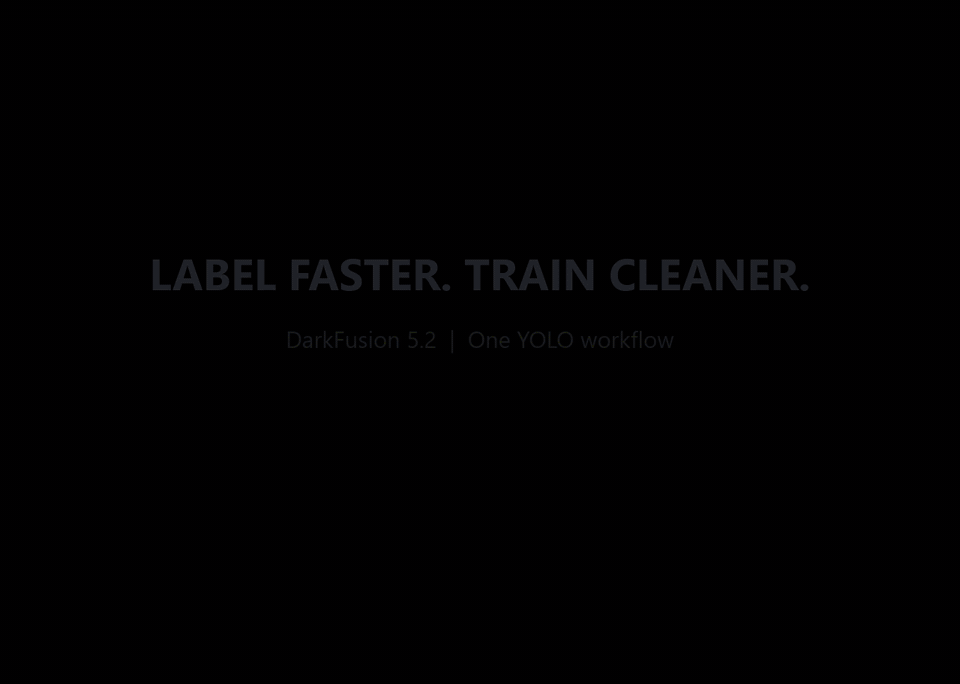
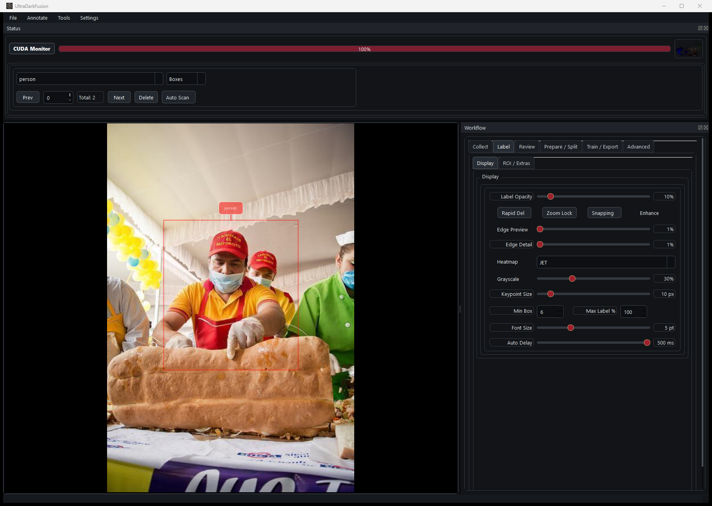
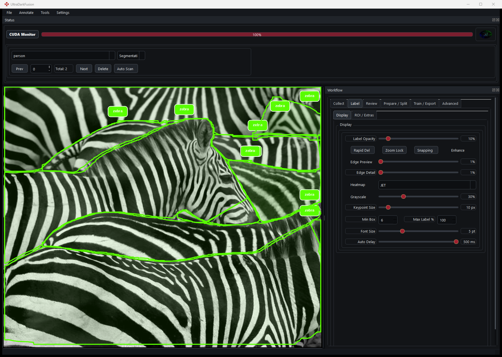
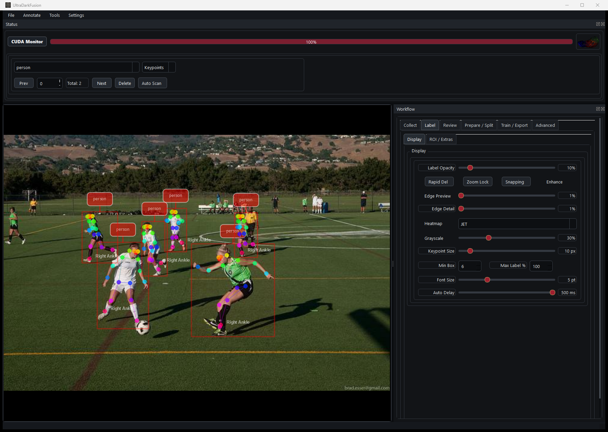
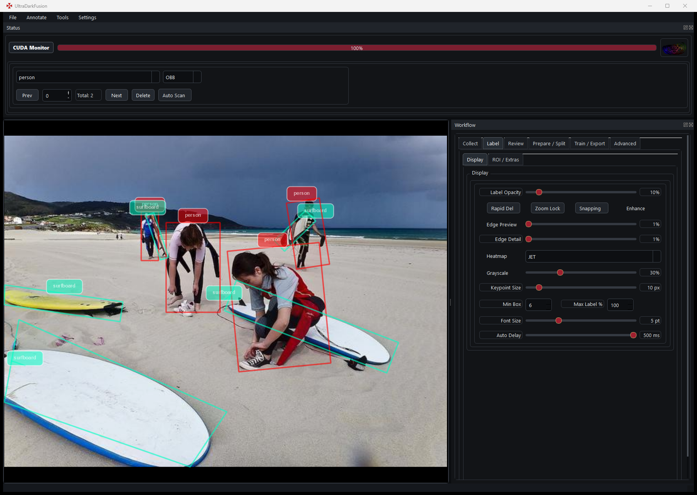
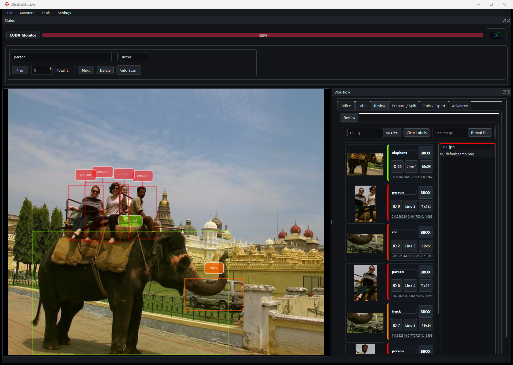

# UltraDarkFusion 5.2



UltraDarkFusion is a Windows desktop application for building YOLO datasets,
labeling images and video, training models, reviewing validation failures, and
running inference through PyTorch, ONNX, or TensorRT.

## Short walkthrough

The walkthrough uses COCO images inside the current UltraDarkFusion 5.2
interface and demonstrates boxes, polygon segmentation, OBB, pose/keypoints,
and dataset review.

[Watch or download the 20-second MP4](samples/darkfusion_walkthrough.mp4)

## Annotation support

| Bounding boxes | Segmentation | Pose / keypoints | OBB |
| --- | --- | --- | --- |
|  |  |  |  |



## Current capabilities

- Bounding-box, polygon segmentation, pose/keypoint, and oriented-box labeling.
- Zoom, pan, snap-assisted editing, configurable frame skipping, and batch
  dataset workflows.
- SAM3-assisted snapping, segmentation conversion, object effects, and
  augmentation with cancellation controls.
- GroundingDINO and YOLO-based automatic labeling.
- Ultralytics training, validation, hyperparameter tuning, and detached
  background runs that remain active when the UI closes.
- Live training charts, artifact viewer, safe stop-after-epoch/stop-now
  controls, run-folder access, and checkpoint access.
- Validation Review for false positives, missed ground truth, wrong classes,
  weak localization, duplicates, and poor keypoints across detect, segment,
  pose, OBB, and classify tasks.
- Dataset analysis for mixed annotations, invalid labels, small targets,
  class balance, model stride, candidate image sizes, and task-aware
  segmentation mask resolution.
- PyTorch `.pt`, ONNX `.onnx`, TensorRT `.engine`, and legacy Darknet model
  workflows.
- SAHI/tiled inference, tracking, frame extraction, camera/desktop capture,
  themes, translations, and voice-assisted class selection.

## Supported system

- Windows 10/11, 64-bit.
- Miniconda or Anaconda.
- Python 3.12 in a dedicated environment named `fusion`.
- NVIDIA GPU and current driver recommended.
- The pinned PyTorch build uses CUDA 12.8 and supports modern NVIDIA GPUs,
  including Blackwell/RTX 50-series.

The normal Python installation does not require compiling OpenCV or installing
a separate CUDA Toolkit. The PyTorch wheel provides its matching CUDA runtime.
A locally installed CUDA Toolkit is only needed for specialized source builds.

## Install

Install [Git](https://git-scm.com/download/win) and
[Miniconda](https://docs.conda.io/projects/miniconda/en/latest/), then:

```powershell
git clone https://github.com/lordofkillz/DarkFusion.git C:\DarkFusion
cd C:\DarkFusion
.\fusion_install.bat
```

The installer:

1. Finds Miniconda/Anaconda without assuming a username-specific path.
2. Creates `fusion` with Python 3.12 when needed.
3. prevents packages from leaking into the user-site directory.
4. installs the pinned CUDA/ML/UI environment from `requirements.txt`.
5. verifies the application files and critical imports.

Launch DarkFusion with:

```powershell
.\run_darkfusion.bat
```

Manual installation is also supported:

```powershell
conda create -n fusion python=3.12 -y
conda activate fusion
$env:PYTHONNOUSERSITE = "1"
python -m pip install --upgrade pip setuptools wheel
python -m pip install --no-user -r requirements.txt
python scripts\verify_install.py
python UltraDarkFusion\UltraDarkFusion_v5.2.py
```

## Models

Large model files are not stored in the Git repository. SAM3 snapping expects
`UltraDarkFusion\Sam\sam3.pt`; GroundingDINO expects
`UltraDarkFusion\Sam\groundingdino_swint_ogc.pth`. YOLO models can be selected
from any local location.

See [MODEL_SETUP.md](MODEL_SETUP.md) for the exact model layout and TensorRT
export notes.

## What belongs in the repository

The repository contains the application source, generated PyQt UI module,
editable `.ui` file, training/validation worker scripts, styles, icons, sounds,
translations, help documents, sight overlays, installer, dependency manifest,
and verification tooling.

The following stay local and are ignored:

- `.env`, `settings.json`, databases, and machine-specific configuration.
- datasets, labels, split lists, run directories, and validation reports.
- `.pt`, `.pth`, `.weights`, `.onnx`, `.engine`, and other model artifacts.
- videos, archives, caches, debug output, recovered copies, and backups.

For large public checkpoints, use a GitHub Release or a dedicated model host
instead of committing them to normal Git history.

## Updating the generated UI

After editing `UltraDarkFusion\UltraDarkFusion_v5.2.ui`, regenerate the Python
module from the activated `fusion` environment:

```powershell
cd UltraDarkFusion
.\generate_ui_py.ps1
```

Commit both `UltraDarkFusion_v5.2.ui` and
`ui_ultradarkfusion_v5_2.py` together.

## Community and acknowledgments

- [UltraDarkFusion Discord](https://discord.gg/fZTz8E44)
- [Ultralytics](https://github.com/ultralytics/ultralytics)
- [GroundingDINO](https://github.com/IDEA-Research/GroundingDINO)
- [SAHI](https://github.com/obss/sahi)
- [Darknet](https://github.com/hank-ai/darknet)
- Inspired by [DarkMark](https://github.com/stephanecharette/DarkMark)

UltraDarkFusion is licensed under the
[GNU Affero General Public License v3](LICENSE.txt).
